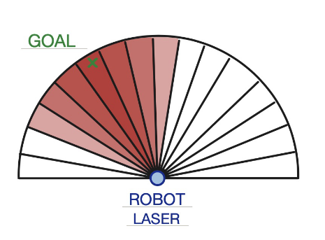
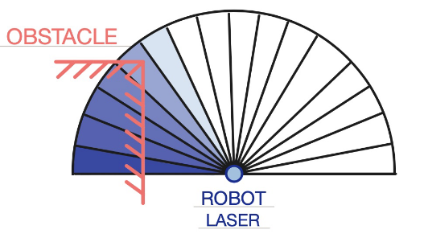
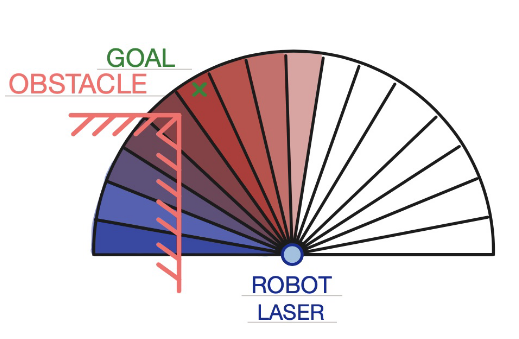
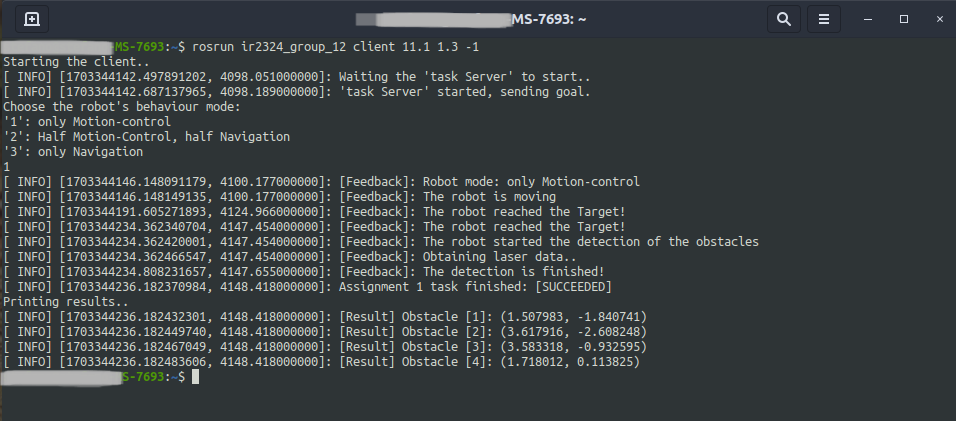
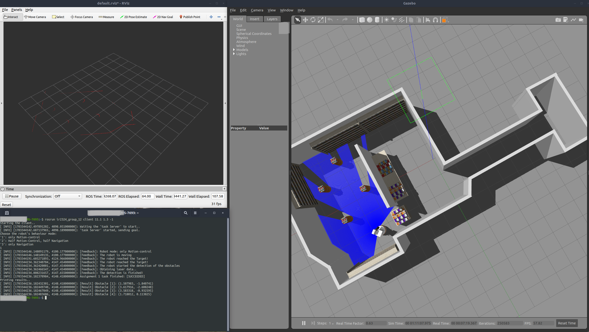

  # Obstacles Detection for Robot Tiago 
  The  goal  of  the  project  is  to  get  the  robot  Tiago  from  the  initial  point  **Starting  Pose**  to  point
  **PoseB** by navigating through the environment that includes two rooms, corridor and obstacles.
  
## Run locally

####  Clone the package
~~~bash  
  git clone https://github.com/Mattolo4/Obstacles-Detection-for-Robot-Tiago.git
~~~

### Compiling istructions
You will need 4 terminal sourced in *~/catkin_ws*

#### Go to the workspace that contains the package
~~~bash  
  cd catkin_ws
~~~

For terminal 1-2-3-4 run:

~~~bash  
  start_tiago
~~~
~~~bash  
  source /opt/ros/noetic/setup.bash
~~~
~~~bash  
  source /tiago_public_ws/devel/setup.bash
~~~
You can *build* only in one terminal:
~~~bash  
  catkin build  
~~~
(in all 4 terminals):
~~~bash  
  source ~/catkin_ws/devel/setup.bash
~~~

### Running istructions
For terminal **1**:
~~~bash  
  roslaunch tiago_iaslab_simulation start_simulation.launch world_name:=robotics_library
~~~
(wait for the simulation started).

For terminal **2**:
~~~bash  
  roslaunch tiago_iaslab_simulation navigation.launch
~~~
(wait for *odom recieved*).

For terminal **3**:
starts the **server**
~~~bash  
  rosrun Assignment_1_group_12 server
~~~

For terminal **4**:
~~~bash  
  rosrun Assignment_1_group_12 client <x> <y> <yaw_angle>
~~~

where *x* and *y* are the **Pose_B** coordinates, and *yaw_angle* it the **Tiago's orientation**.  

##  Description  
  Once  Tiago  reaches  the  PoseB,  it  must  **recognize  the  obstacles**,  cylindrical  in  shape,  from  his
  surroundings and indicate how many there are and their location in the room.
  Tiago can reach PoseB in three different ways:

- The first involves using the motion control low that we developed to reach PoseB directly,
  thus never using the **Navigation stack** (1);
- The second implies an **hybrid** control: involves using a **motion control low** that we developed to cross the corridor and
  then using the **Navigation stack** to reach PoseB (2); 
- The  third  involves  using  the  control  low  that  is  already  there  by  taking  advantage  of  the
  **Navigation stack** (3).

## Structure
We implement an Action Client/Server structure:
* **Client**:  the action client receives the input from the user by command line, by providing:
  - The x, y coordinates regarding location and yaw regarding orientation. This informationwill go to create PoseB that corresponds to our goal.
  - Which of the three possible motion control laws the user want to use choosing between 1, 2, 3.

Once the goal is obtained,  the client sends the information to the server.
The action client also implements **callbacks** to the **feedback** of the action server, and prints the task's current
status in the terminal.

* **Server**: the action server executes all the tasks.
  - First it acts as a client for the **move action**, used to reach our goal, sending the information to the dedicated server that will process the robot's movement, in accordance
  with the mode chosen as the motion control law to achieve the goal (1, 2, 3).
  
  - Once the goal is reached, it subscribes to the topic **/scan** to get the information regarding
  the  surroundings  area. This  information  will  then  be  used  for  locating  objects  and
  counting them.

  - When all the information is obtained, the server returns it to the client indicating the
  **location** (in the ”base laser link” reference frame) and **quantity** of obstalces in the room.
## Objects detection

Our approach takes into account the following **assumptions**:  the objects to be detected should be
*detached  from the wall* and *cylindrical* in shape.  Informations
obtained from the laser scan present on Tiago was used to detect obstacles.

---

The approach is as follows:
* Using  the  distance  data  associated  with  a  certain  angle  obtained  from  the  laser  scan,  we
calculate  the  **derivative**  (understood  as  the  difference  of  two  consecutive  values: **[i]-[i-1]**)to  detect  discontinuities.
This  works  like  an  *edge  detector*  in  image  processing,  detecting
the  right  edge  discontinuities  in  the  laser  scan  since  the  scan  is  counter  clockwise.
Such discontinuities, in fact, highlight the presence of a different object, since the difference of two
consecutive points will be a very small value if they belong to the same element (e.g., the wall).  
Saving the obtained values in a **vector** having the length equal to the laser data vector.

* Once  we  have  obtained  the  vector  of  discontinuities,  we  check  vector  values  and  **remove**
ones that are too small, choosing a threshold value of 0.5m proved to be a good value to
distinguish objects and walls.  
In this way, we get a vector where most of the values are zero, except for the indexes where we detect the **right-edge** of an object.

* Then this vector was used as a guideline to create another vector of only the data points that correspond to objects, 
this was accomplished by taking the original distance value (corresponding to the right-edge index of object) and keeping the following distance values until
they are within a threshold in a counter-clockwise sweeping motion.  We then obtain a vector
with all zero values but the distance values corresponding to the various objects.

* To find the **center of the objects**, knowing it is of a cylindrical shape, we choose to take the
initial, halfway, final points of the singular objects and **interpolate a circle**.  From the 
interpolated circle we then obtain the center point coordinates with respect to the *base-laser-link-frame*.

This approach also **ignores** all points too close to the sensor, such as parts of the robot itself.  
The detection was tested in various position on the map and was found to be successful in detecting
the  visible  object  and  obtaining  the  correct  center-point  values.  
## Motion Control Law

This task  was  to  implement  a  **motion  control  law**  to
reach a goal point that directly process the sensor data and generate velocity command for the
robot in the *mobile_base_controller/cmd_vel*
without using the *move_base* stack.

To achieve this, the idea was similar to the **potential fields** algorithm but implemented in a **reactive and radial
form**. We  computed  two  vectors,  an  **attractive  force  vector**  and  a  **repulsive  force  vector**  which
are then summed to create the **total force vector**.  This vectors have a size equal to a radius *2π×angle_increment* to obtain a vector size of 1088.
In this way the **robot X-axis** direction is the halfway point of the array, the points after this are the positive angles **+θ** and the ones before are
the negative angle **−θ**.

* The attractive force vector was computed by first obtaining the **index** of the bin correspondingto the **Goal heading angle**,  then the vector was compiled by assigning a value of **1** to this
index  and  a  *linearly*  decreasing  value  for  all  other  more  distant  indexes. 

> This  means  the closer you are pointing to the goal heading angle the higher attractive force value.

* The repulsive force vector was instead computed using the **LaserScan message** from the scanand by setting the repulsive force to *0* if nothing was detected or was out of the laser sight
and setting it to *1−g×range[i]* if anything was detected, where *g* is the potential repulsive
gain that can be tuned.

* The **total force vector** was then computed summing the two previous force vectors.

  
  
<em>Attractive potential</em>

  
  
<em>Repulsive potential</em>

  
  
<em>Total potential</em>

From the total force vector we can select the index corresponding to **highest potential** which is
then used as the angular direction for the robot to follow to reach the goal and avoid collisions.  

To improve this rudimental approach many steps of *pre-processing* were implemented.  

The LaserScan data was **smoothed** within the 8 nearest neighbours so that the fall-off from object corners was gradual,
this is needed because the robot thinks itself as a point and may believe to be able topass close to a corner without hitting it. 
Then an obstacle detection function was implemented which  takes  a **cone**  in  front  of  the  robot  as  detection  area  where,  
if  anything  is  detected  inside this  area,  the  repulsive  force  for  the  corresponding  bins  are  **incremented**  depending  
on  the  freespace left.  

Also a **fail-safe function** was implemented so that if anything was detected in a ”dangerzone”  (which  is  a  semicircle  of  radius  0.5  from  the  robot  and *±70◦* from  the  X-axis)  the  robot will **rotate until it clears this obstacle**.

After obtaining the safe best heading angle direction the **velocity commands are published** in the appropriate topic as a *geometry_msgs::Twist_message* which contains the linear velocity in the X-axis and the angular velocity in the Z-axis.

The **linear velocity** was computed as: *v∗(π−maxPotAngle)/(π∗frontRange/2)* where *v* is the **linear velocity gain**, *maxPotAngleis* the chosen **angle with max potential** and *frontRange* is the
**laser detection** in front of the robot. 

This results in a dynamic linear velocity that let the robot travel fast when nothing is in front of it and slow down when it has to do a turn. 

The **angular speed** was instead computed as :  *(maxPotAngle∗angleVelGain)/π* where *angleVelGain* is a *tunable
gain* value for the angle velocity.
## Results
ResultsIn  all  three  modes  **1,  2,  3**  once  the  goal  is  reached,  the  detection  of  the  number  of  obstacles  iscorrect  and  equal  to  *four* (according to our simulation). 

Even  when  testing  the  detection  where  an  obstacle  was  completely occluded  three  objects  where  correctly  detected.   The  position  of  the  centers  of  the  cylindrical 
objects calculated by us corresponds to the correct one displayed through **Rviz**.
This was tested on different goals and was successful in all cases.

  
  
<em>Client terminal</em>

  
  
<em>Results terminal + Simulation (Gazeboo) + LaserData (Rviz)</em>

## Developers
- [Gabriel Taormina](mailto:gabriel.taormina@protonmail.com) 
- Stefano Trenti
- [Matteo Villani](https://github.com/Mattolo4?tab=repositories)

  
